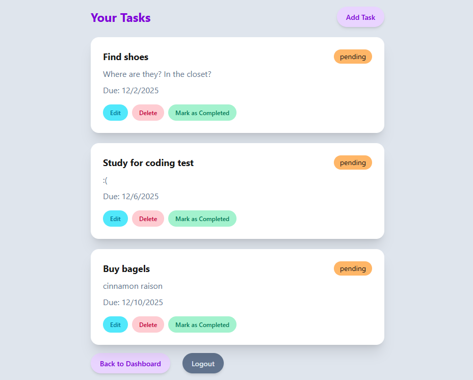

## About The Project
Taskly is a simple task management application designed to help users stay organized and productive. It features a simple registration and login system where users can securely manage personalized to-do lists. Taskly showcases both SQL and NoSQL databases by storing user accounts in MongoDB and managing task data through PostgreSQL.

Users can add tasks, update their status from pending to completed, edit details or remove them entirely. Validation is implemented on both the client and server side to ensure clean, reliable data.

  

### Built With

[![Express.js]][Express.js-url]
[![MongoDB]][MongoDB-url]
[![Mongoose]][Mongoose-url]
[![PostgreSQL]][PostgreSQL-url]
[![Sequelize]][Sequelize-url]
[![Tailwind]][Tailwind-url]
[![DaisyUI]][DaisyUI-url]

## Getting Started
To use the app, you can access it through the deployed vercel link below. Feel free to create your own account, or use the below test account to play around with the site!

<b>Username:</b> test 
<b>Password:</b> test

<a href="https://taskly-ten-beta.vercel.app/" target="_blank">Check out the deployed site here</a>

## Contact

Phoenix Ouyang - [LinkedIn](https://www.linkedin.com/in/phoenixouyang/) - [GitHub](https://github.com/phoenixouyang)

<!-- MARKDOWN LINKS & IMAGES -->

[Express.js]: https://img.shields.io/badge/espress.js-black?style=for-the-badge&logo=express&link=https%3A%2F%2Fexpressjs.com%2F
[Express.js-url]: https://expressjs.com/
[MongoDB]: https://img.shields.io/badge/mongodb-black?style=for-the-badge&logo=mongodb&link=https%3A%2F%2Fwww.mongodb.com%2F
[MongoDB-url]: https://www.mongodb.com/
[Mongoose]: https://img.shields.io/badge/mongoose-grey?style=for-the-badge&logo=mongoose&link=https%3A%2F%2Fmongoosejs.com%2Fdocs%2F
[Mongoose-url]: https://mongoosejs.com/docs/
[PostgreSQL]: https://img.shields.io/badge/postgresql-E0B441?style=for-the-badge&logo=postgresql&link=https%3A%2F%2Fwww.postgresql.org%2F
[PostgreSQL-url]: https://www.postgresql.org/
[Sequelize]: https://img.shields.io/badge/sequelize-black?style=for-the-badge&logo=sequelize&link=https%3A%2F%2Fsequelize.org%2F
[Sequelize-url]: https://sequelize.org/
[Tailwind]: https://img.shields.io/badge/tailwind-black?style=for-the-badge&logo=tailwindcss&link=https%3A%2F%2Ftailwindcss.com%2F
[Tailwind-url]: https://tailwindcss.com/
[DaisyUI]: https://img.shields.io/badge/daisyui-grey?style=for-the-badge&logo=daisyui&link=https%3A%2F%2Fdaisyui.com%2F%3Flang%3Den
[DaisyUI-url]: https://daisyui.com/?lang=en
